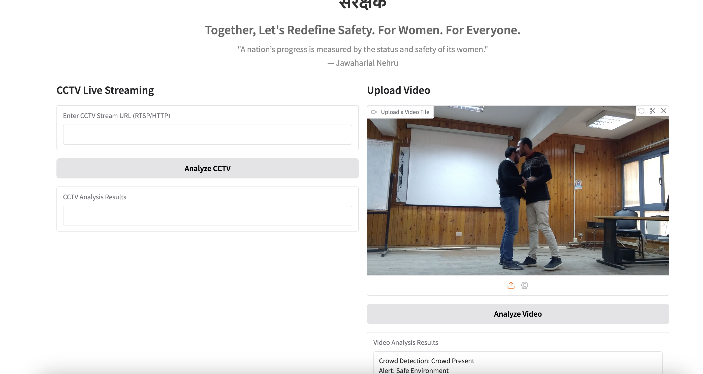

# SangRakshak: AI-Powered Women's Safety System

SangRakshak is an AI-driven security system designed to enhance safety for women by detecting potential threats in **real-time video feeds**.  
It supports **CCTV live streaming & manual video uploads**, providing AI-powered analysis for **crowd detection, violence detection, and gender identification**.

---

## 🌟 Features
- **🎥 AI-Powered Video Analysis** – Detects **crowd presence, violent activities, and gender** from video footage.  
- **📡 CCTV Live Streaming Support** – Monitors real-time CCTV feeds via **RTSP/HTTP URLs**.  
- **🔒 Secure & Encrypted Processing** – Uses **AES encryption** for video frame protection.  
- **🚨 Real-Time Alerts** – Identifies **potential threats** and generates alerts accordingly.  
- **🎨 Aesthetic & Responsive UI** – User-friendly **Gradio-based interface** for seamless usage.  

---

## 🖥️ Live Demo  
🔗 **Access the hosted application here:**  
👉 **[sangRakshak AI System](https://3355981ad566a5b159.gradio.live/)**  

---

## 📸 Reference Image  
Below is a screenshot of the working system:  

  

---

## 🚀 How to Use
## **1️⃣ Run the Application**

python app.py

## 2️⃣ Choose an Analysis Mode  
You can analyze videos using one of the following methods:  

- Enter a CCTV stream URL (RTSP/HTTP)  
- Upload a video file for AI-based safety analysis  

## 3️⃣ Click "Analyze"  
- The system will process the footage using AI models.  
- If a threat is detected, an alert will be triggered.  

---

## 🛠️ Tech Stack  
- **Python3**  
- **TensorFlow** (For Crowd Detection Model)  
- **PyTorch** (For Gender & Violence Detection Models)  
- **OpenCV** (For Video Processing)  
- **Gradio** (For Web Interface)  
- **AES Encryption** (For Secure Video Processing)  

---

## ✨ Core AI Models  
**sangRakshak** utilizes three AI models for real-time safety assessment:  

1. **Gender Classification Model** – Identifies gender from video frames.  
2. **Violence Detection Model** – Detects potential violent actions.  
3. **Crowd Detection Model** – Recognizes the presence of a crowd.  

These models work together to evaluate the safety of an environment in real-time.  

